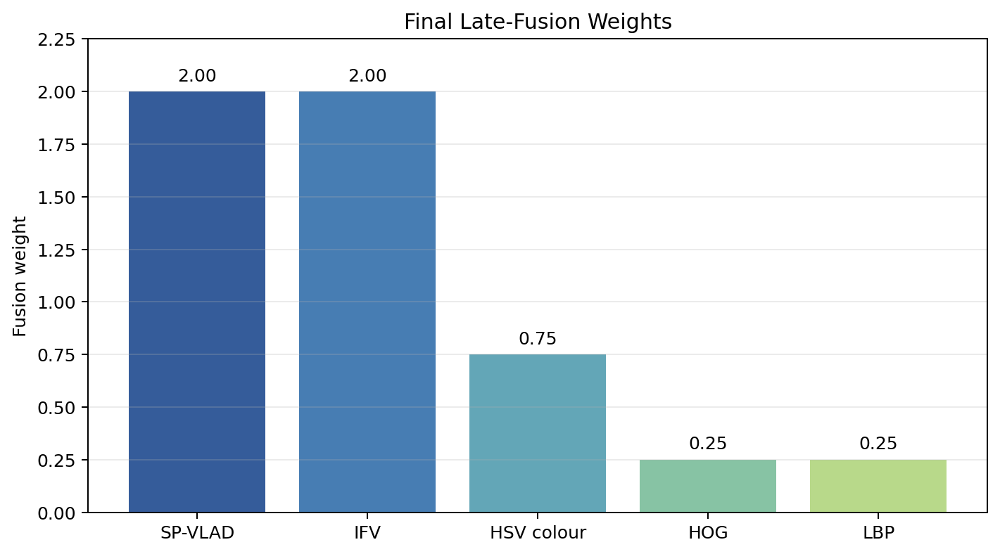
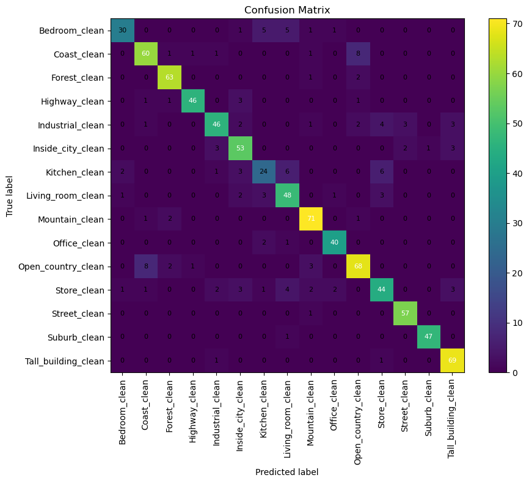

# Multi-Branch Handcrafted Feature Fusion for Scene Classification

A classical computer vision pipeline for classifying images from the **15-Scene dataset** without neural networks. The system combines local, texture, shape, and colour descriptors through branch-wise LinearSVC classifiers and late score fusion.

## Highlights

- Classifies **4,485 images across 15 indoor and outdoor scene categories**.
- Uses an 80/20 stratified split: **3,588 training images** and **897 held-out test images**.
- Reuses a shared dense RootSIFT and PCA-whitening backbone for Spatial Pyramid VLAD and Improved Fisher Vector encodings.
- Combines SP-VLAD, IFV, HOG, LBP, and HSV colour histograms with weighted late fusion.
- Achieves **85.40% test accuracy** using a fully handcrafted, CPU-compatible pipeline.

## Dataset

The project uses the public [15-Scene Dataset](https://www.kaggle.com/datasets/zaiyankhan/15scene-dataset). Its categories include bedrooms, coasts, forests, highways, industrial scenes, city interiors, kitchens, living rooms, mountains, offices, open country, stores, streets, suburbs, and tall buildings.

The dataset is not redistributed here. Download and folder-layout instructions are available in [`data/README.md`](data/README.md).

## Pipeline

1. Read the folder-based dataset and perform a stratified 80/20 train-test split.
2. Extract dense RootSIFT descriptors from grayscale images.
3. Apply PCA whitening to reduce descriptor redundancy.
4. Encode local descriptors using Spatial Pyramid VLAD and Improved Fisher Vector.
5. Extract complementary HOG, LBP, and HSV colour-histogram features.
6. Train one LinearSVC classifier per feature branch with cross-validated hyperparameters.
7. Optimize branch weights using out-of-fold predictions from the training set.
8. Fuse decision scores and evaluate once on the held-out test set.

## Feature Branches

| Branch | Information captured |
|---|---|
| SP-VLAD | Local appearance and spatial layout |
| IFV | First- and second-order local descriptor statistics |
| HOG | Global gradient and structural layout |
| LBP | Local micro-texture |
| HSV histogram | Global colour composition |

## Results

The final weighted ensemble achieved:

| Metric | Value |
|---|---:|
| Test accuracy | **85.40%** |
| Macro precision | 85.00% |
| Macro recall | 85.00% |
| Macro F1-score | 85.00% |
| Weighted F1-score | 85.00% |

The stored final fusion weights are:

| Feature | Weight |
|---|---:|
| SP-VLAD | 2.00 |
| IFV | 2.00 |
| HSV colour histogram | 0.75 |
| HOG | 0.25 |
| LBP | 0.25 |





The strongest confusions occur mainly among visually related indoor categories, such as bedroom, kitchen, living room, and store, and among outdoor categories such as coast and open country.

## Repository Structure

```text
.
├── README.md
├── requirements.txt
├── .gitignore
├── data/
│   └── README.md
├── models/
│   └── README.md
├── src/
│   └── scene_classification.py
├── notebooks/
│   ├── dataset_audit.ipynb
│   ├── scene_classification.ipynb
│   └── inspect_saved_results.ipynb
├── results/
│   ├── classification_report.csv
│   ├── metrics.csv
│   └── summary.json
└── assets/
    ├── ensemble_confusion_matrix.png
    └── fusion_weights.png
```

Large datasets, cached feature matrices, fitted codebooks, and serialized models are excluded from Git history.

## Installation

```bash
python -m venv .venv
source .venv/bin/activate      # Windows: .venv\Scripts\activate
pip install -r requirements.txt
```

Place the dataset under `data/15_scene/`, or set the `DATA_DIR` environment variable:

```bash
DATA_DIR=/path/to/15_scene python src/scene_classification.py
```

## Reproducibility Notes

- The train-test split is stratified and uses a fixed random seed.
- Feature codebooks and PCA are fitted only on the training split.
- Fusion weights are selected from out-of-fold training predictions.
- The 897-image test set is reserved for final evaluation.
- Published notebooks have their outputs cleared to keep the repository lightweight; compact verified metrics remain under `results/`.

## Limitations

- Results use a single dataset split rather than repeated cross-validation.
- Handcrafted features may be less robust than modern pretrained models under large domain shifts.
- Several indoor categories share similar textures and layouts, producing class-level confusion.
- Runtime remains significant because dense local descriptors are extracted on CPU.

## Future Work

- Repeated stratified evaluation with confidence intervals
- Comparison with pretrained CNN and vision-transformer baselines
- Probability calibration and alternative fusion strategies
- Feature-selection and dimensionality-reduction studies
- Cross-dataset evaluation under domain shift

## Project Attribution

This repository documents an academic scene-classification project. Team members and individual responsibilities should be added accurately before the repository is used as evidence of personal contribution.
